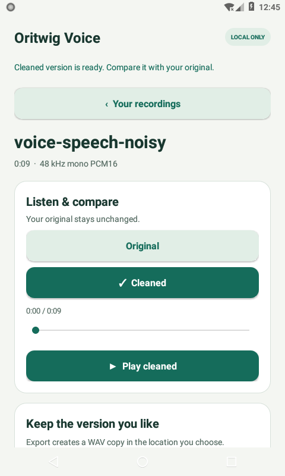

# Oritwig RNNoise

A standalone C/Java/JNI module using the **unchanged RNNoise core and default model vendored by Telegram**. No Telegram account, client or network dependency.

## Upstream versus this module

RNNoise is Xiph/Mozilla and contributor work, not Telegram-authored DSP. [Telegram uses it in capture processing](https://github.com/DrKLO/Telegram/blob/f2908b14133bbffbf7ab04f641ecb5bfaf533242/TMessagesProj/jni/voip/tgcalls/group/GroupAudioCapturePostProcessor.cpp#L48-L99). The [exact pinned subtree](https://github.com/DrKLO/Telegram/tree/f2908b14133bbffbf7ab04f641ecb5bfaf533242/TMessagesProj/jni/voip/rnnoise) is preserved: all 21 files, all model weights and all denoising operations are unchanged.

Upstream is a reusable library and its README already documents a raw-PCM demo CLI. We add isolated CMake targets, checked state/PCM/JNI adapters, Android AAR packaging and provenance/tests. There is no replacement neural model, DSP, codec or resampler. Unlike Telegram’s full application, this module has no messaging, calls, account system or network stack.

The independent Android consumer [Oritwig Voice](https://github.com/athemeroy/oritwig-voice) adds recording, local WAVs, A/B playback and export. The module itself has no UI.




## Contract and use

- 48 kHz mono PCM16; **480 samples per frame**
- One state per continuous stream; reset between independent recordings
- Embedded default model only; no conversion of unsupported rates or channels
- The engine API does not silently pad, flush or compensate its streaming delay. The Voice app’s file adapter defines and tests that policy

```java
try (RnnoiseDenoiser engine = new RnnoiseDenoiser()) {
    engine.processFrame(pcm480); // real RNNoise, in place
}
```

## Build and verification

CMake, Ninja, Python 3 and a JDK are needed. Android packaging also needs NDK r27c; tested with CMake 3.22.1.

```sh
python3 tools/verify_source.py
bash tools/test-host.sh
# With JAVA_HOME and ANDROID_NDK_HOME set:
bash tools/build-android.sh
```

Host native/reference/JNI/CLI tests and API26 ART checks pass. Synthetic tests establish processing, state and wrapper correctness; real-speech listening, microphone quality and hardware performance remain unverified. [Technical reference](docs/TECHNICAL.md) · [Diff ledger](docs/DIFF_LEDGER.md) · [Verification](docs/VALIDATION.md).

Original licenses and per-file notices remain in `vendor/rnnoise` and [THIRD_PARTY_NOTICES.txt](THIRD_PARTY_NOTICES.txt). New adapters/build/test code: [BSD-3-Clause](LICENSE). No upstream endorsement is implied.
